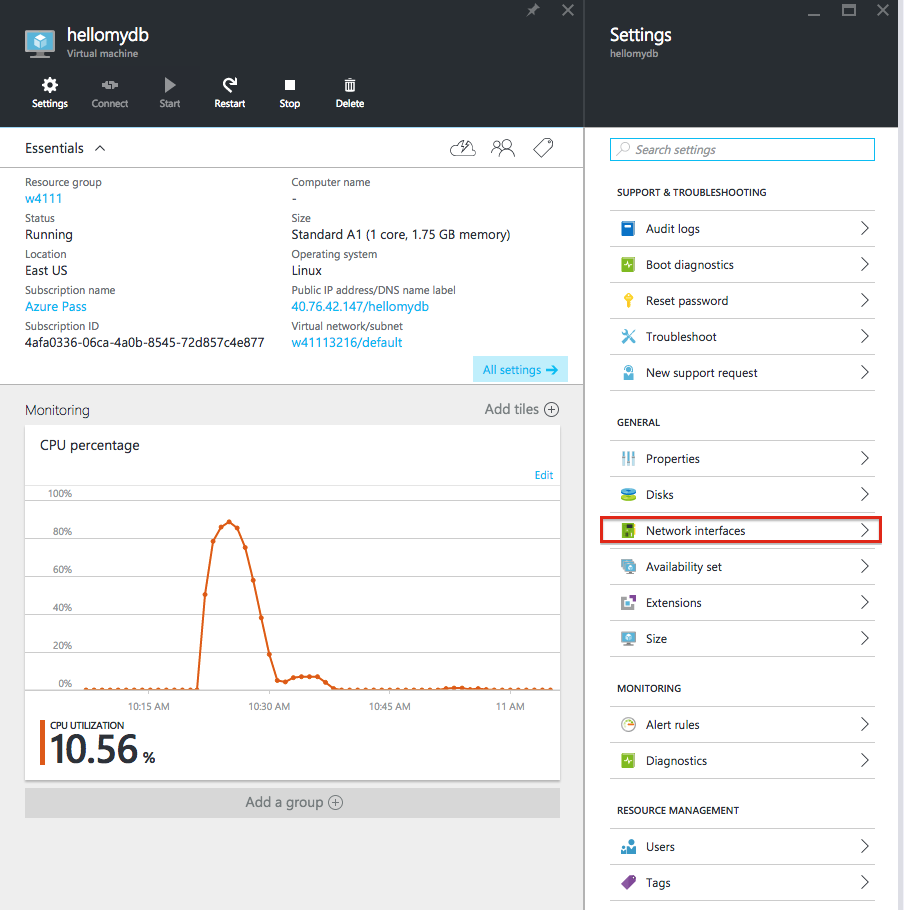
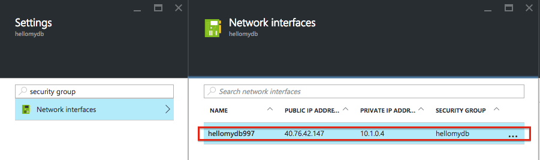
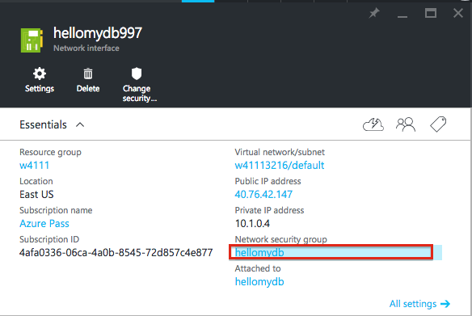
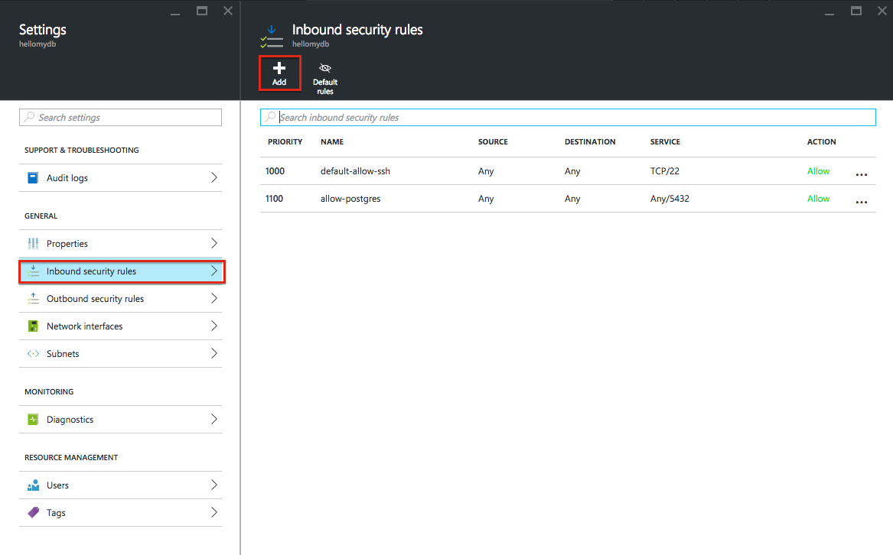

# Opening a port on Azure

By default, Microsoft Azure and other cloud platforms put your virtual machine behind a firewall, so it is not accessible from the Internet. Anything that is accessible on the public Internet is constantly being probed by other people who find it entertaining to access systems they aren't supposed to (a.k.a "hackers"). After you follow these steps, your Python web application will be accessible to anyone! Please don't put any valuable data on the virtual machine.

Azure (and other cloud platforms) have the concept of a "Network security group" that contains a set of network firework rules. When a virtual machine is created, it is placed in a security group. All the virtual machines in that group have the same rules applied.  To make a port accessible, you need to edit the network security group for your virtual machine:

1. Go to your Azure portal page for your virtual machine.
2. Click on "All Settings" then "Network Interfaces" to show the list of virtual network devices.

3. Your VM should only have one device, so click on the one displayed under Network Interfaces to display the network settings for your Virtual machine:

4. Click on the name underneath "Network security group".

5. The right hand "Settings" pane should show the settings for the network security group that your VM is attached to. Click "Inbound security rules", then click the Add button:

6. In the Name box, write a description like "allow-flask". In "destination port range" type 8111. Leave everything as the default. Click OK.
7. You should see "creating security rule" pop up. In about a minute, it will say "created security rule" and your pane will show the new rule.

You can now connect to your virtual machine at http://(YOURIP):8111/
